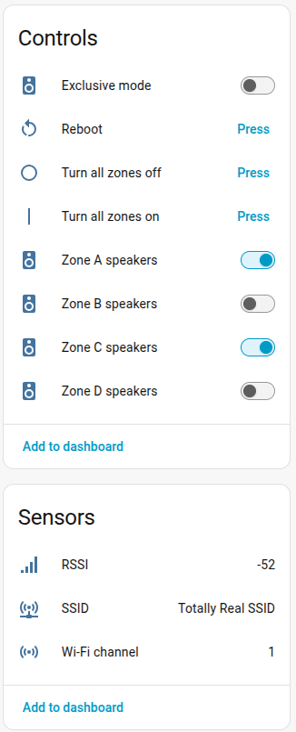

# Audioflow to MQTT Gateway

audioflow2mqtt enables local control of your Audioflow speaker switch(es) via MQTT. It supports Home Assistant MQTT discovery for easy integration. It can also automatically discover the Audioflow devices on your network via UDP discovery, or you can specify the IP address of the Audioflow devices if you don't want to use UDP discovery.

<br>

# Configuration
audioflow2mqtt can be configured using a configuration file named **config.yaml** or with environment variables; the two are mutually exclusive. If a `config.yaml` is present in the working directory (mounted at `/config.yaml` in the container) it is used and environment variables are ignored; otherwise configuration comes entirely from the environment. Example config.yaml with all possible configuration options:
```yaml
mqtt:
  host: 10.0.0.2
  port: 1883
  user: user
  password: password
  qos: 1
  base_topic: audioflow2mqtt
  home_assistant: True

general:
  devices:
  - 10.0.1.100
  - 10.0.1.101
  discovery_port: 54321
  log_level: debug
```

**Configuration options:**

| Variable | Default | Required | Description |
|----------|---------|----------|-------------|
| `MQTT_HOST` | None | True |IP address or hostname of the MQTT broker to connect to. |
| `MQTT_PORT` | 1883 | False | The port the MQTT broker is bound to. |
| `MQTT_USER` | None | False | The user to send to the MQTT broker. |
| `MQTT_PASSWORD` | None | False | The password to send to the MQTT broker. |
| `MQTT_QOS` | 1 | False | The MQTT QoS level. |
| `BASE_TOPIC` | audioflow2mqtt | False | The topic prefix to use for all payloads. |
| `HOME_ASSISTANT` | True | False | Set to `True` to enable Home Assistant MQTT discovery or `False` to disable. |
| `DEVICES` | None | False | By default the gateway finds your Audioflow device(s) automatically via UDP discovery. Set this to use specific IP address(es) instead, which disables UDP discovery. With environment variables it must be a comma-separated string (if multiple); in config.yaml it must be a list. |
| `DISCOVERY_PORT` | 54321 | False | The port to open on the host to send/receive UDP discovery packets. |
| `LOG_LEVEL` | info | False | Set minimum log level. Valid options are `debug`, `info`, `warning`, and `error` |

<br>

# How to run

**Docker via `docker-compose` with config.yaml**

1. Create your docker-compose.yaml (or add to existing). Example docker-compose.yaml:
```yaml
version: '3'
services:
  audioflow2mqtt:
    container_name: audioflow2mqtt
    image: tediore/audioflow2mqtt:stable
    volumes:
    - /path/to/config.yaml:/config.yaml
    restart: unless-stopped
    network_mode: host # only required if devices option is not set in config.yaml
```
2. `docker-compose up -d audioflow2mqtt`

<br>

**Docker via `docker run` with config.yaml**

Example `docker run` command:
```
docker run --name audioflow2mqtt \
-v /path/to/config.yaml:/config.yaml \
--network host \ # only required if devices option is not set in config.yaml
tediore/audioflow2mqtt:stable
```

<br>

**Docker via `docker-compose` without config.yaml**

1. Create your docker-compose.yaml (or add to existing). Example docker-compose.yaml with all environmental variables:
```yaml
version: '3'
services:
  audioflow2mqtt:
    container_name: audioflow2mqtt
    image: tediore/audioflow2mqtt:stable
    environment:
    - MQTT_HOST=10.0.0.2
    - MQTT_PORT=1883
    - MQTT_USER=user
    - MQTT_PASSWORD=password
    - MQTT_QOS=1
    - BASE_TOPIC=audioflow2mqtt
    - HOME_ASSISTANT=True
    - DEVICES=10.0.1.100,10.0.1.101
    - DISCOVERY_PORT=54321
    - LOG_LEVEL=debug
    - TZ=America/Chicago # optional, but will ensure logging has local time instead of UTC (change to your timezone).
    restart: unless-stopped
    network_mode: host # only required if DEVICES variable is not set
```
2. `docker-compose up -d audioflow2mqtt`

<br>

**Docker via `docker run` without config.yaml**

Example `docker run` command with all environment variables:
```
docker run --name audioflow2mqtt \
-e MQTT_HOST=10.0.0.2 \
-e MQTT_PORT=1883 \
-e MQTT_USER=user \
-e MQTT_PASSWORD=password \
-e MQTT_QOS=1 \
-e BASE_TOPIC=audioflow2mqtt \
-e HOME_ASSISTANT=True \
-e DEVICES=10.0.1.100,10.0.1.101 \
-e LOG_LEVEL=debug \
--network host \ # only required if DEVICES variable is not set
tediore/audioflow2mqtt:stable
```

<br>

**Bare metal (not recommended)**
1. Set the necessary environment variables or create config.yaml
2. `git clone https://github.com/Tediore/audioflow2mqtt`
3. `cd audioflow2mqtt`
4. `python3 audioflow2mqtt.py`

<br>

# Home Assistant
audioflow2mqtt supports Home Assistant MQTT discovery which creates a Device for the Audioflow switch with the following:
- Switch entities for each zone
- A switch entity for "exclusive mode" (a feature in firmware version >= v1.10.000035 which allows for only one zone to be turned on at any given time)
- Button entities to turn all zones on/off and reboot the device
- Sensors for SSID, RSSI (signal strength), and Wi-Fi channel



<br>

# MQTT topic structure and examples

All topics are prefixed with your `BASE_TOPIC` (default `audioflow2mqtt`). The examples below use the default base topic and the serial number `0123456789` (found on the sticker on the bottom of the device). Zones are numbered A = 1, B = 2, and so on.

**Commands you send**

Publish to these topics to control a device. Per-zone commands take a trailing zone number; the all-zones command does not.

| Command topic | Valid payloads | Effect |
|---------------|----------------|--------|
| `audioflow2mqtt/0123456789/set_zone_state/<zone>` | `on`, `off`, `toggle` | Turn one zone on/off, or toggle it |
| `audioflow2mqtt/0123456789/set_zone_state` | `on`, `off` | Turn **all** zones on/off (no zone number; `toggle` is not supported here) |
| `audioflow2mqtt/0123456789/set_zone_enable/<zone>` | `1`, `0` | Enable (`1`) or disable (`0`) one zone |
| `audioflow2mqtt/0123456789/set_exclusive_mode1 | `on`, `off` | Enable or disable exclusive mode |

**Topics the gateway publishes**

Zone state is published after any change and refreshed by polling (device state every 10 seconds, network info every 60 seconds). The device does not report a new state after a command, so the gateway re-reads the affected zone(s) and republishes.

- **Zone state:** `audioflow2mqtt/0123456789/zone_state/<zone>`: `on` or `off`
- **Zone enabled/disabled:** `audioflow2mqtt/0123456789/zone_enabled/<zone>`: `1` or `0`

Network info:

- **SSID:** `audioflow2mqtt/0123456789/network_info/ssid`
- **Wi-Fi channel:** `audioflow2mqtt/0123456789/network_info/channel`
- **RSSI:** `audioflow2mqtt/0123456789/network_info/rssi`

Exclusive mode:
- **Exclusive mode** `audioflow2mqtt/0123456789/exclusive mode`: `on` or `off`

Availability (retained, used by Home Assistant for online/offline status):

- `audioflow2mqtt/status`: `online`/`offline` for the gateway itself. This is published as a retained Last Will message, so if the gateway disconnects unexpectedly the broker publishes `offline` on its behalf.
- `audioflow2mqtt/0123456789/status`: `online`/`offline` for an individual device, depending on whether it is reachable.

<br>

# Important notes
A single instance handles multiple Audioflow devices; every topic is namespaced by the device serial number, so they don't collide. You only need a separate instance (with a **different base topic**) if you deliberately run more than one copy against the same broker.

While audioflow2mqtt does support UDP discovery of Audioflow devices, creating a DHCP reservation for your Audioflow device(s) and setting `DEVICES` is recommended for reliability. UDP discovery will only work if the Audioflow device is on the same subnet as the machine audioflow2mqtt is running on.

<br>
<a href="https://www.buymeacoffee.com/tediore" target="_blank"></a>

<br>

# TODO
1. ~~Handle Audioflow device disconnects/reconnects~~
2. Add support for re-discovery of Audioflow switch if its IP address changes
3. ~~Add support for multiple Audioflow switches? Not sure how many people would have more than one.~~
4. You tell me!
