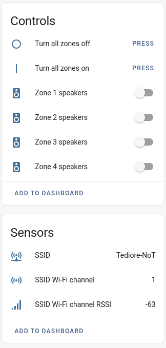

# Audioflow to MQTT Gateway

`audioflow2mqtt` enables you to control your Audioflow speaker switch locally via MQTT. It supports Home Assistant MQTT discovery for easy integration. It can also automatically discover the Audioflow device on your network via UDP discovery (you can also specify the IP address of the Audioflow device if you don't want to use UDP discovery). Currently only supports one Audioflow device unless you run separate instances.

**This is a initial release which might have bugs but should be reasonably stable.**

# Docker Compose
Example compose file with all possible environmental variables listed:
```yaml
version: '3'
services:
  audioflow2mqtt:
    container_name: audioflow2mqtt
    image: tediore/audioflow2mqtt:latest
    environment:
    - MQTT_HOST=10.0.0.2
    - MQTT_PORT=1883
    - MQTT_USER=user
    - MQTT_PASSWORD=password
    - MQTT_CLIENT=audioflow2mqtt
    - MQTT_QOS=1
    - BASE_TOPIC=audioflow2mqtt
    - HOME_ASSISTANT=True
    - DEVICE_IP=10.0.1.100
    - DISCOVERY_PORT=54321
    - LOG_LEVEL=debug
    restart: unless-stopped
    network_mode: host # only required if DEVICE_IP is not set
```

# Configuration
| Variable | Default | Required | Description |
|----------|---------|----------|-------------|
| `MQTT_HOST` | `None` | True | IP address or hostname of the MQTT broker to connect to. |
| `MQTT_PORT` | `1883` | False | The port the MQTT broker is bound to. |
| `MQTT_USER` | `None` | False | The user to send to the MQTT broker. |
| `MQTT_PASSWORD` | `None` | False | The password to send to the MQTT broker. |
| `MQTT_CLIENT` | `audioflow2mqtt` | True | The client name for the MQTT connection. |
| `MQTT_QOS` | `1` | False | The MQTT QoS level. |
| `BASE_TOPIC` | `audioflow2mqtt` | True | The topic prefix to use for all payloads. |
| `HOME_ASSISTANT` | `True` | False | Set to `True` to enable Home Assistant MQTT discovery and `False` to disable. |
| `DEVICE_IP` | `None` | False | IP address of your Audioflow device. Not required if using UDP discovery. |
| `DISCOVERY_PORT` | `54321` | False | The port to open on the host to send/receive UDP discovery packets. Required if `DEVICE_IP` is not set. |
| `LOG_LEVEL` | `info` | False | Set minimum log level. Valid options are `debug`, `info`, `warning`, and `error`. |

# Home Assistant integration
`audioflow2mqtt` supports Home Assistant MQTT discovery which creates a Device for the Audioflow switch and entities for each zone and enabling/disabling zones.



# MQTT topic structure and examples
The command topics start with `BASE_TOPIC/serial_number/zone_number/` where `BASE_TOPIC` is the base topic you define, `serial_number` is the device serial number (found on the sticker on the bottom of the device) and `zone_number` is the switch you want to control (starting from 1 on the left)

The examples below assume the base topic is the default (`audioflow2mqtt`) and the serial number is `0123456789`.

**Turn zone 2 on or off**

Topic: `audioflow2mqtt/0123456789/2/set_zone_state`

Payload: `on` or `off`

**Enable or disable zone 1**

Topic: `audioflow2mqtt/0123456789/1/set_zone_enable`

Payload: `1` for enabled, `0` for disabled

<br>

When the zone state or enabled/disabled status is changed, audioflow2mqtt publishes the result to the following topics:

**Zone state:** `audioflow2mqtt/0123456789/ZONE/zone_state`

**Zone enabled/disabled:** `audioflow2mqtt/0123456789/ZONE/zone_enabled`

<br>
<a href="https://www.buymeacoffee.com/tediore" target="_blank"></a>
